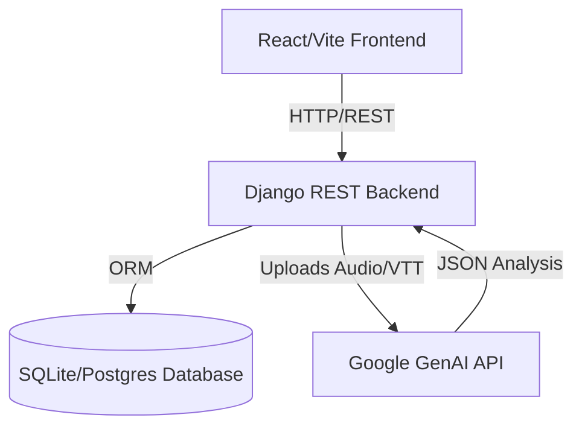

# Architecture Overview

Intelliconnect follows a decoupled client-server architecture. The frontend is a Single Page Application (SPA) built with React and Vite, communicating via RESTful APIs to a Django backend. The backend acts as an orchestration layer between the database, the frontend, and the external AI service (Google Gemini).

## System Architecture Diagram

## Layer Description

1. **Presentation Layer (Frontend)**: 
   - Uses React Router for protected and public views.
   - State managed centrally by Zustand, combined with `react-hook-form` for form state.
   - Communicates with the backend using the `/api/` proxy setup in Vite.

2. **API & Orchestration Layer (Backend)**: 
   - Django REST Framework provides structured endpoints.
   - Specifically handles file uploads and temporarily stores them for AI processing.
   - Implements a decoupled flow where AI processing (`process_meeting`) returns raw JSON, and the user must explicitly confirm to save it (`save_analysis`).

3. **Data Layer**:
   - Manages relational data for Meetings, Tasks, Participants, and Transcript Segments.
   - Employs a specific model (`IntegratedIntelligence`) designed to trigger external webhooks/notifications via Supabase (or similar DB-level triggers).

4. **External Services**:
   - **Google OAuth**: Used directly by the frontend for authentication, synchronizing basic user details via `/api/auth/save_user/`.
   - **Google GenAI (Gemini 3.1 Flash-Lite)**: Processes audio files and transcripts to generate structured Pydantic schemas.