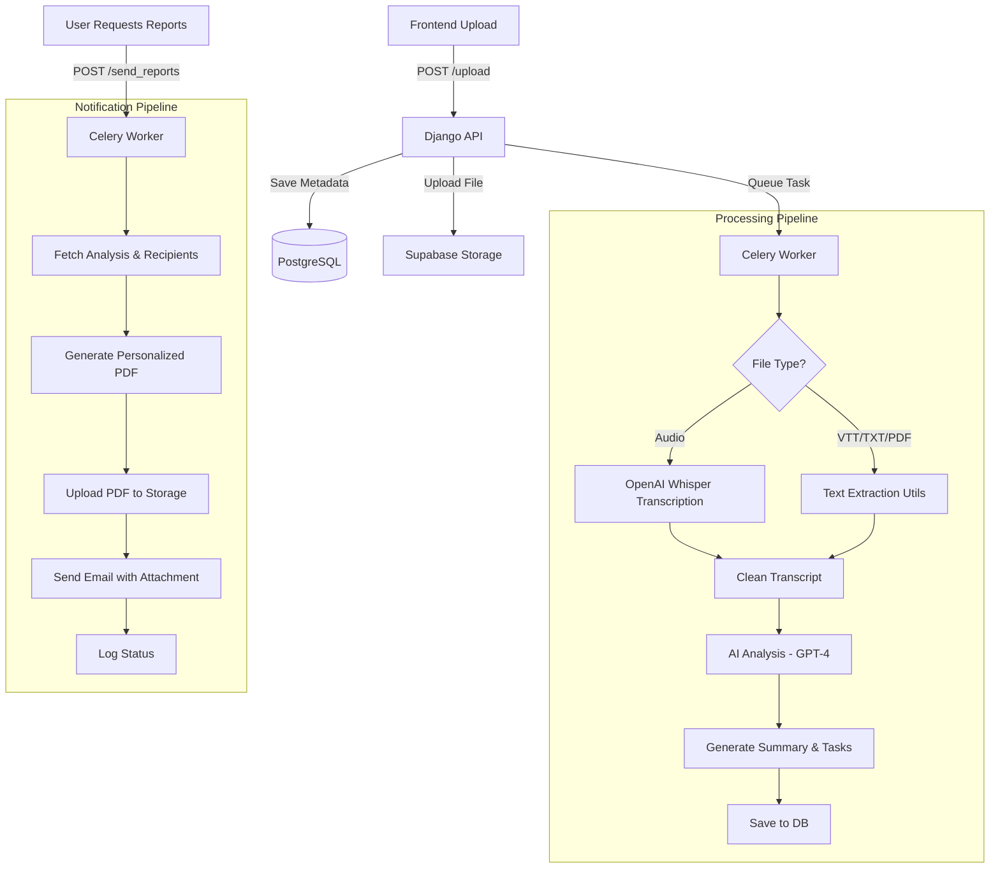

# Meeting Intelligence Processing Workflow

```mermaid
graph TD
    A[Frontend Upload] -->|POST /upload| B[Django API]
    B -->|Save Metadata| C[(PostgreSQL)]
    B -->|Upload File| D[Supabase Storage]
    B -->|Queue Task| E[Celery Worker]
    
    subgraph "Processing Pipeline"
    E --> F{File Type?}
    F -->|Audio| G[OpenAI Whisper Transcription]
    F -->|VTT/TXT/PDF| H[Text Extraction Utils]
    G --> I[Clean Transcript]
    H --> I
    I --> J[AI Analysis - GPT-4]
    J --> K[Generate Summary & Tasks]
    K --> L[Save to DB]
    end
    
    M[User Requests Reports] -->|POST /send_reports| N[Celery Worker]
    
    subgraph "Notification Pipeline"
    N --> O[Fetch Analysis & Recipients]
    O --> P[Generate Personalized PDF]
    P --> Q[Upload PDF to Storage]
    Q --> R[Send Email with Attachment]
    R --> S[Log Status]
    end
```
