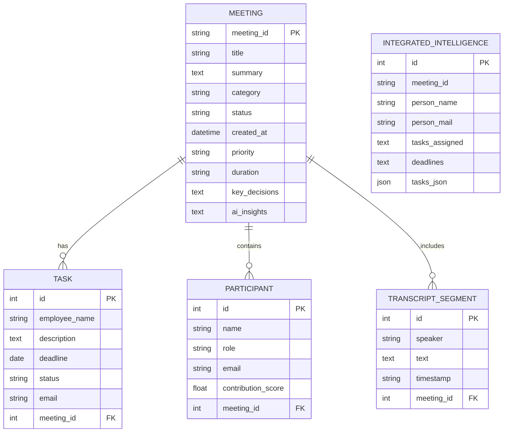

# Database Schema

The application primarily uses Django's ORM mapped to an underlying database (SQLite by default).

## Entity Relationship Diagram

## Model Descriptions

| Model | Purpose | Key Fields |
|-------|---------|------------|
| `Meeting` | Central entity representing a processed session. | `meeting_id`, `summary`, `key_decisions`, `ai_insights`, `priority` |
| `Task` | Action items extracted by the AI. | `employee_name`, `deadline`, `description`, `email`, `status` |
| `Participant` | People identified in the meeting. | `name`, `role`, `contribution_score`, `email` |
| `TranscriptSegment` | Extracted or parsed conversational chunks. | `speaker`, `text`, `timestamp` |
| `IntegratedIntelligence` | Flat representation created per-participant to easily interface with Supabase webhooks for automated emails/notifications. | `person_mail`, `tasks_assigned`, `deadlines` |