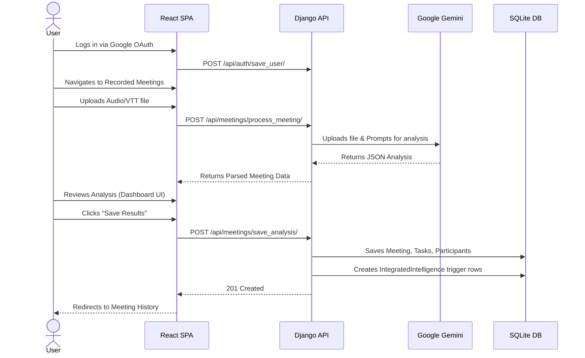

# System Workflow

This document illustrates the end-to-end user journey within Intelliconnect.

## End-to-End User Flow

## Step Details

1. **User Authentication**: Handled client-side via Google's Identity Provider. The profile is blindly synced to the backend to create a Django `User` record.
2. **Meeting Transcript Upload**: User provides raw meeting artifacts (Video, Audio, or Text).
3. **AI Processing**: The backend handles the polling required for large audio files on Google's GenAI platform before prompting.
4. **Summary & Extraction**: Gemini analyzes the tone, decisions, and assigns tasks using Pydantic schemas.
5. **Dashboard Update**: The results are immediately previewed on the frontend before being committed.
6. **Task Assignment & Storage**: Once confirmed, data is persisted. `IntegratedIntelligence` records are formulated per participant to feed event-driven downstream tools (e.g. Supabase webhooks sending emails).